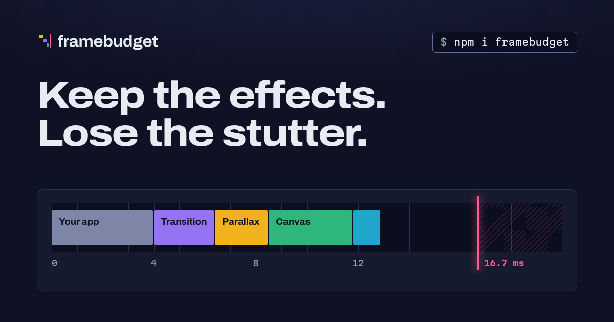

# framebudget



Keep the effects. Lose the stutter.

At 60 Hz every frame has a 16.7 ms budget. Each visual effect (parallax, page transitions, canvas animations, sounds, blur) spends part of it. framebudget measures how much budget a device really has and allows only the effects that fit, so slow phones never stutter and fast phones keep everything.

- A small inline boot script decides before the first paint, so an animation never starts only to freeze.
- A fixed-time CPU benchmark gives a score where 100 is the reference phone.
- Each effect has its own threshold with hysteresis, instead of one global tier.
- A runtime governor watches real frame gaps and steps the most expensive effects down.
- Local learning remembers which effects stuttered on this device. Nothing leaves the device.
- Optional, anonymous telemetry is off by default and is enabled by the site developer, never by default.

> The reference rates and thresholds are provisional. They come from one desktop Chrome measurement scaled down to stand for a mid-range phone, and they will change once they are calibrated on real devices.

## Install

```sh
npm install framebudget
```

ESM only, with type declarations. `react` is an optional peer dependency, needed only for `framebudget/react`.

### From GitHub Packages

Releases are published to GitHub Packages as `@framebudget/framebudget`. Point the scope at the GitHub registry in your project's `.npmrc`, with a GitHub token that has `read:packages`:

```ini
@framebudget:registry=https://npm.pkg.github.com
//npm.pkg.github.com/:_authToken=${GITHUB_TOKEN}
```

Then install it under its usual name, so the imports below stay as they are (prereleases are on the `next` dist-tag):

```sh
npm install framebudget@npm:@framebudget/framebudget
```

## 1. Add the boot script

Inline the boot script as the first script in `<head>`, before your CSS. It runs the cold benchmark (about 2 ms), decides, and writes the result on `<html>`:

```html
<html data-framebudget="High" data-framebudget-effects="hover entrances parallax ...">
```

Generate the tag at build or render time:

```ts
import { bootScript, createBootScript } from "framebudget/boot";

// Default options:
const head = `<script>${bootScript}</script>`;

// With the same calibration you pass to configure(), so boot and core agree:
const custom = `<script>${createBootScript({ calibration: { effects: { confetti: { threshold: 60, cost: 4, motion: true } } } })}</script>`;
```

The script is self-contained (about 10.3 KB minified, 4.3 KB gzipped), never throws, and works when any browser API is missing. With a Content Security Policy, add a nonce or the script's hash.

CSS can gate effects without any JavaScript:

```css
html[data-framebudget-effects~="parallax"] .hero { transform: translateY(var(--parallax)); }
html[data-framebudget-effects~="blur"] .sheet { backdrop-filter: blur(16px); }
```

## 2. Ask the budget

```ts
import { budget } from "framebudget";

if (budget.allows("parallax")) startParallax();

budget.on("change", (snapshot, reason) => {
  // The device heated up, a tier stepped down, the warm benchmark finished...
  update(snapshot.effects);
});
```

The core starts on the first call to any method. It adopts the boot script's decision, runs a longer warm benchmark at the `load` event (when the CPU has ramped up and the engine has optimized the code), then starts the governor. The warm score drives the effects and is cached for the next page. Without the boot script, the core runs the cold benchmark itself on first use.

On the server (no `window`), `allows()` answers `false` and `tier` is `Lite`.

### React

```tsx
import { useBudget, useTier } from "framebudget/react";

function Page() {
  const animate = useBudget("pageTransition"); // boolean, re-renders on change
  const tier = useTier();
  return animate ? <AnimatedRoute /> : <Route />;
}
```

During server rendering and hydration, `useBudget` answers `false` and `useTier` answers `Lite`, so effects only start on the client. `BudgetProvider` is only needed for a budget other than the page's (for example `createBudget()` in tests).

## API

| Member | Description |
| --- | --- |
| `budget.allows(effect)` | May this effect run on this device? Unknown effects answer `false`. |
| `budget.tier` | The current tier: `"Full"`, `"High"`, `"Medium"` or `"Lite"`. |
| `budget.score` | Score after hardware caps and pressure, or `null` on the server. |
| `budget.effects()` | The allowed effects. |
| `budget.snapshot()` | Everything: scores, kernel rates, hints, the reason each effect is off, fps per source, calibration. |
| `budget.on("change", fn)` | Calls `fn(snapshot, reason)`, and returns the unsubscribe function. Reasons: `warm`, `governor`, `pressure`, `motion`, `force`, `simulate`, `configure`. |
| `budget.off("change", fn)` | Unsubscribes. |
| `budget.reportFrame(gapMs, source?)` | Reports the time between two frames. See the governor section. |
| `budget.register(name, definition)` | Adds an effect, or replaces one. |
| `budget.configure(options)` / `configure(options)` | Calibration, governor and sharing options. Call it before the `load` event. |
| `budget.force(tier \| "auto")` | Forces a tier for the session. |
| `budget.simulate(score \| null)` | Debug and demo only. See the section on simulating a device. |
| `createBudget(options?)` | A separate instance, for tests or embedded widgets. |
| `Tier` | `Tier.Full`, `Tier.High`, `Tier.Medium`, `Tier.Lite`. The type `Tier` is their union. |

## Effects

Each effect has a score threshold, a relative frame cost, and optional flags. The flags are `motion` (turned off by `prefers-reduced-motion: reduce`) and `data` (turned off by Save-Data or a 2g connection).

| Effect | Threshold | Cost | Flags |
| --- | --- | --- | --- |
| `hover` | 20 | 1 | |
| `canvasLowRes` | 30 | 3 | motion |
| `entrances` | 35 | 2 | motion |
| `shimmer` | 45 | 2 | motion |
| `sound` | 50 | 1 | data |
| `pageTransition` | 55 | 3 | motion |
| `parallax` | 70 | 5 | motion |
| `blur` | 90 | 6 | |
| `canvasHiRes` | 120 | 8 | motion, data |

Register your own:

```ts
budget.register("confetti", { threshold: 60, cost: 4, motion: true });
```

Pass the same definitions to `createBootScript({ calibration: { effects } })` so the first paint already knows them.

**Hysteresis.** Scores wander between page loads, so a device near a threshold could flip an effect on every visit. To prevent this, an effect that was on stays on down to `threshold * (1 - hysteresis)`, and an effect that was off turns on only from `threshold * (1 + hysteresis)`. The default margin is 10%. The previous state is kept across pages.

## Tiers

Tiers are shortcuts for sets of effects. A tier's set is every effect whose threshold is at or below the tier floor:

| Tier | Floor | Effects |
| --- | --- | --- |
| `Lite` | 20 | hover |
| `Medium` | 35 | + canvasLowRes, entrances |
| `High` | 70 | + shimmer, sound, pageTransition, parallax |
| `Full` | 120 | + blur, canvasHiRes |

The reported tier is the highest tier whose whole set is allowed. Effects that are off because of a user preference (reduced motion, Save-Data) do not lower the tier. Thresholds, learning and the governor do.

**Forcing, for debugging.** Add `?framebudget-tier=Full|High|Medium|Lite` to the URL to force a tier for the rest of the session, and `?framebudget-tier=auto` to go back. You can also call `budget.force(tier)`. A forced tier sets that tier's exact effect set and still honors reduced motion and Save-Data. The governor and telemetry pause while a tier is forced.

**Diagnostics panel.** Add `?framebudget` to the URL to open an overlay with the scores, kernel rates, hints, the state of each effect, the fps per source, and buttons to force a tier. It is loaded on demand from `framebudget/panel` and costs nothing otherwise. Use `configure({ panel: false })` to disable it, or `mountPanel(budget)` from `framebudget/panel` to mount it yourself.

## Simulating a device (debug and demo API)

`budget.simulate(score)` replaces the measured score with `score` for the session. This is useful for a "try a slower device" control or for testing a design at each tier. `budget.simulate(null)` returns to the real device. The URL equivalents are `?framebudget-score=40` and `?framebudget-score=off`. The boot script and the core both read the session value, so the first paint of the next page already uses it.

The simulated score goes through the normal path: thresholds with hysteresis, hardware caps, pressure, reduced motion, and the governor, which still steps effects down. Each call clears the effects the governor stepped down on the page, and always emits `change` with reason `simulate`. While simulating, nothing is written about the real device: no learning, no cached score, no hysteresis state. Effects learned on the real device are not applied, and no telemetry is sent. `snapshot().simulated` holds the score, and `snapshot().source` is `"simulated"`.

This API is for debugging and demos. Do not use it to make product decisions.

## The benchmark

The benchmark runs four small kernels: float math, typed array read and write, small object allocation with property access, and canvas path building on an `OffscreenCanvas` when available. Each kernel is measured as work units per millisecond in short, fixed-time slices.

- The first round is a warm-up. It is discarded, and it sizes the batches so that reading the clock stays cheap on fast devices.
- Slices are chained on clock ticks, so the coarse `performance.now()` of browsers (100 microseconds in Chrome) still gives accurate rates. A clock too coarse to measure anything falls back to `calibration.fallbackScore`.
- The score is the median per kernel, then the geometric mean of the ratios against the reference rates, times 100. One kernel that is very fast or very slow cannot dominate the score.
- Every kernel result feeds a sink that is kept, so no kernel can be eliminated as dead code.

There are two runs. The cold run is in the boot script (1.6 ms of slices). The warm run happens at `load`, with 5 rounds spread over separate tasks so it never becomes a long task. Cold code runs in the engine's lower tiers and is several times slower than warm code, so each run has its own reference rates.

**Hints.** `deviceMemory <= 1` GB or `hardwareConcurrency <= 2` caps the score at 60. Compute Pressure (`PressureObserver`, where available) scales the score by 0.7 when the state is `serious` and by 0.4 when it is `critical`, and the budget changes live. `prefers-reduced-motion`, Save-Data and 2g turn off flagged effects and are watched live.

## The governor

The governor starts at `load`. It ignores the first 3 s, then judges windows of 30 frames by their median gap. A window whose median is below the target (45 fps) is a strike. After 3 strikes in a row from one source, it steps down one effect, waits a 2 s cooldown, and emits `change`.

- Frames reported by `"main"` or `"worker"` step down the most expensive allowed effect (highest cost first, then highest threshold).
- Frames reported with an effect's name step down that effect. Report your canvas loop as `budget.reportFrame(gap, "canvasHiRes")`.

framebudget samples main-thread frames by itself with `requestAnimationFrame`. It samples for the first seconds and while the user interacts (scroll, pointer, keys), not forever. Use `configure({ governor: { auto: false } })` to report frames yourself only. Workers post their gaps to the page:

```ts
// worker
postMessage({ type: "frame", gap });
// page
worker.addEventListener("message", (e) => {
  if (e.data.type === "frame") budget.reportFrame(e.data.gap, "worker");
});
```

You can tune `targetFps`, `windowFrames`, `strikes`, `warmupMs`, `cooldownMs`, `cleanWindows` and `maxGapMs` with `configure({ governor })`.

## Local learning

Local learning is always on and stays on the device: one `localStorage` entry per origin, with access guarded. When the governor steps an effect down, that effect is remembered and the next visits start without it. After 5 clean visits (visits with enough smooth frames and no step down), the effect is tried again. If it holds up, it is forgotten. If it stutters again, the wait doubles. The cached warm score and the effects that passed their thresholds on the last page are stored in the same entry.

## Calibration

All numbers that turn measurements into decisions live in one object, `defaultCalibration`: reference rates (warm and cold), effect thresholds and costs, tier floors, hysteresis, hardware caps, pressure factors, the fallback score, the maximum age of a cached score, and the number of clean visits before a retry. Override any part of it:

```ts
configure({
  calibration: {
    effects: { parallax: { threshold: 80 } },
    tiers: { High: 80 },
    hysteresis: 0.15,
  },
});
```

The precedence is: built-in numbers, then a calibration fetched from your server (see below), then your overrides. Every value is validated, so a bad patch cannot break decisions. Changing `version` or the reference rates invalidates cached scores.

## Telemetry and privacy

Sharing is **off by default**, and there is no default endpoint. Only the site developer can enable it:

```ts
configure({
  share: {
    endpoint: "https://example.com/framebudget", // receives the report
    sampleRate: 0.1,                              // share of page views that report (default 0.1)
    minIntervalDays: 7,                           // days a browser waits before reporting again (default 7)
    calibrationUrl: "https://example.com/framebudget/calibration.json", // optional
  },
});
```

- **What is sent.** The report contains the calibration version, the cold, warm and effective scores, the kernel rates, the clock resolution, hardware hints (cores, memory, pressure), the reduced-motion preference, the tier, the allowed effects, the effects stepped down, and the median fps per reported source. Numbers are rounded.
- **What is not sent.** No identifiers, cookies, URL, user agent or timestamps. Only sampled page views report.
- **When.** One `navigator.sendBeacon` call when the page is hidden, after load.
- **How often.** At most one report per browser every `minIntervalDays` days (default 7), so frequent visitors do not outweigh the rest. A new calibration version reports at once. The date of the last report is kept in the same `localStorage` entry as local learning; no identifier leaves the device. Browsers without storage cannot be throttled and report on every sampled page view.
- **Never with Global Privacy Control or Save-Data.** Nothing is sent when `navigator.globalPrivacyControl` or Save-Data is on, checked again at send time. Nothing is sent while a tier is forced or a device is simulated.
- **Letting visitors say no.** `configure({ share: null })` turns sharing off at any time, also after load: a report already armed for this page is not sent. Keep the visitor's choice yourself (for example in `localStorage`) and pass `share: null` on later visits.
- **The browser still sends.** The beacon request carries what every request carries (the IP address and the `Origin` header). Handle it on your server accordingly.

With `calibrationUrl`, framebudget fetches a calibration patch (JSON in the `calibration` format) at most once a day, after load, without credentials. It never blocks rendering, and the patch is applied from the next visit. The fetch follows the same rules as the report: it needs sharing to be enabled, and it is skipped under Global Privacy Control and Save-Data.

## Development

```sh
npm install
npm run build      # boot script bundle, then tsup (ESM and .d.ts)
npm test           # vitest, then the release script tests (node --test)
npm run typecheck
npm run lint       # eslint (rules below); lint:fix applies the safe fixes
npm run format     # prettier
npm run size       # minified and gzipped sizes per entry
```

The library is the repository root. `docs/` is the landing page and API reference (a separate Vite project that links the library, see `docs/README.md`), `worker/` is the Cloudflare Worker that serves `docs/dist` and collects the site's reports (see `worker/README.md`), `assets/brand/` holds the logo, fonts and tokens, and `assets/video/` the HyperFrames launch video.

A pre-commit hook (husky and lint-staged, installed by `npm install`) formats and lints the staged files, then runs the typecheck, the full lint and the tests.

The source is layered, and `eslint.config.js` enforces the layers:

- `src/core`: pure functions (tier, calibration, decision, learning, telemetry report). No mutation, no loops, no browser access.
- `src/benchmark`, `src/governor`: measurement.
- `src/platform`: every browser access (storage, URL overrides, hints, document attributes, beacon, fetch), wrapped so it never throws.
- `src/startup`: the first decision, shared by the boot script and the core.
- `src/budget`, `src/boot`, `src/react`, `src/panel`: the public entries.

Lint limits: 80 lines per file and 60 per function (blank and comment lines excluded), 8 files per folder (group by concern in subfolders past that), interfaces and type aliases only in `*.types.ts` files (`*.enum.ts` for a const object and its union type), kebab-case file names, descriptive identifiers.

`src/boot/source.generated.ts` is generated from `src/boot/runtime.ts` by `scripts/build-boot.mjs`. The build, test and typecheck scripts regenerate it.

### Pull request checks

`.github/workflows/ci.yml` runs on pull requests that are ready for review; drafts skip it until they are marked ready. Each part runs only when the pull request touches it:

- **Library** (`src/`, `test/`, `scripts/`, root configs and manifests): format check, lint, typecheck, tests, build and size.
- **Website** (`docs/`, the library source, `README.md`): builds the library, then type-checks and builds the site.
- **Worker** (`worker/`, `src/core/`): typecheck and tests.

The `CI` job sums them up: it fails when a part that ran failed, and passes when the others were skipped. A change to the workflow itself runs every part.

### Releases

Releases are immutable: once published, a release's tag and assets can never change. Cut one by pushing a new tag `vX.Y.Z` (or `vX.Y.Z-rc.N`), above the previous one, from an up-to-date `main`:

```sh
git switch main && git pull
git tag v0.3.0 && git push origin v0.3.0
```

`.github/workflows/release.yml` then:

1. checks the tag (format, order, no existing release) and warns in the run summary when the commits ask for a bigger bump (breaking: major, minor while 0.x; feat: minor);
2. writes the notes from the commits since the previous tag, split into Library (`src/`, `README.md`, the build, runtime `package.json` fields) and Website (`docs/`, `worker/`), renders the release art (`assets/brand/build/release.html`), and opens a `chore(release): vX.Y.Z` pull request with `CHANGELOG.md`, the package version and the art in `docs/public/releases/`;
3. when the library changed: verifies the registry signatures of the dependencies, audits them, tests, builds and packs the tarball once (only `dist/`, `package.json` and `README.md`, no install scripts), then publishes that exact tarball to GitHub Packages as `@framebudget/framebudget` (`next` dist-tag for prereleases);
4. deploys the site and the worker to Cloudflare;
5. creates a draft release with the notes, the art, the tarball and `SHA256SUMS`, publishes it, and verifies the attestation GitHub signs over the tag, the commit and every asset.

Check a release yourself with `gh release verify vX.Y.Z` and `gh release verify-asset vX.Y.Z <file>`, and where a file was built with `gh attestation verify <file> --repo framebudget/framebudget` (build provenance: the workflow run and the commit that produced it).

Preview the notes with `npm run release:notes -- --tag v0.2.0 --dry-run` (HEAD stands in for a tag that does not exist yet), and the art with `npm run release:art -- --version 0.2.0 --date 2026-10-03 --notes notes.json --out art.png` (headless Chrome, `CHROME_PATH` to override).
